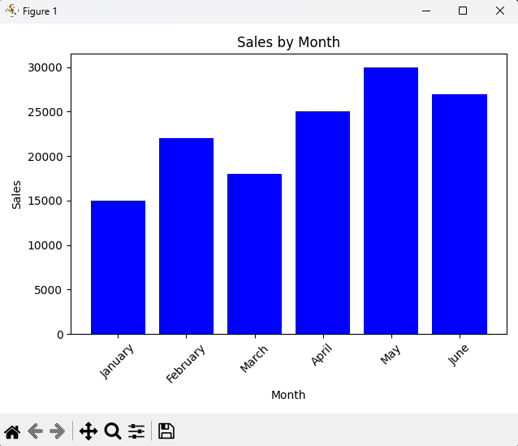
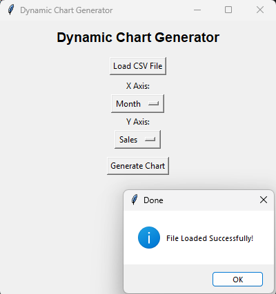

# 📊 Dynamic Chart Generator

A Python GUI tool that loads any CSV file and automatically generates professional bar charts based on user-selected columns.

Built with **Python**, **Pandas**, **Matplotlib**, and **Tkinter**.

---

## 🖥️ Output Preview




---

## ✨ Features

- Load any CSV file with one click
- Auto-detects all columns from the CSV
- User selects X and Y axis from dropdown menus
- Generates professional bar charts instantly
- Works with any data — sales, students, inventory, and more
- Simple and clean GUI — no technical knowledge needed

---

## 📦 Requirements

Install dependencies using pip:

```bash
pip install pandas matplotlib
```

---

## 🚀 How to Use

1. Clone the repository:
```bash
git clone https://github.com/abdullahautomation/dynamic-chart-generator.git
```

2. Navigate to the project folder:
```bash
cd dynamic-chart-generator
```

3. Run the script:
```bash
python main.py
```

4. Click **"Load CSV File"** and select your CSV file ✅
5. Select your **X Axis** and **Y Axis** columns from the dropdowns
6. Click **"Generate Chart"** — your chart appears instantly! 📊

---

## 📁 Project Structure

```
dynamic-chart-generator/
│
├── main.py              # Main Python script
├── sales_data.csv       # Sample CSV file for testing
├── README.md            # Project documentation
└── screenshots/         # Output previews
    ├── gui.png          # GUI window screenshot
    └── chart.png        # Generated chart screenshot
```

---

## 🛠️ Built With

- [Python](https://www.python.org/)
- [Pandas](https://pandas.pydata.org/)
- [Matplotlib](https://matplotlib.org/)
- [Tkinter](https://docs.python.org/3/library/tkinter.html)

---

## 👨‍💻 Author

**Abdullah Mughal**
🔗 [GitHub](https://github.com/abdullahautomation)
🌐 [Fiverr](https://www.fiverr.com/abdullah7514)

---

## 📃 License

This project is open source and available under the [MIT License](LICENSE).